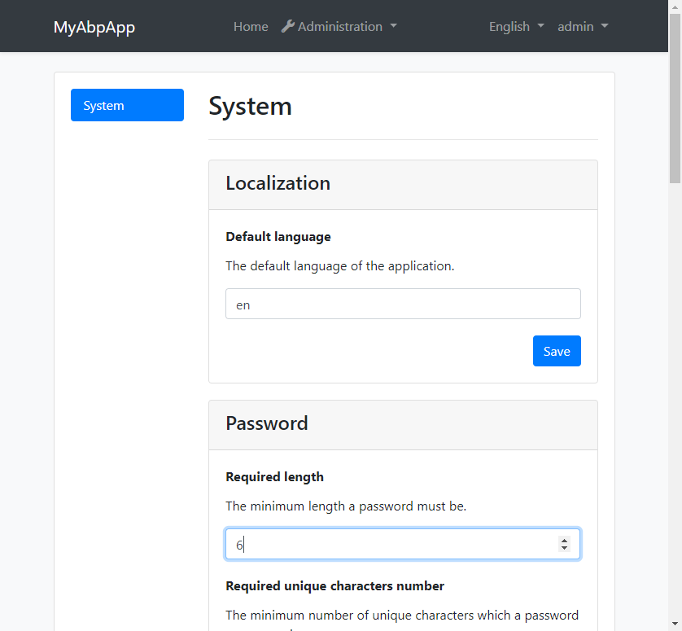
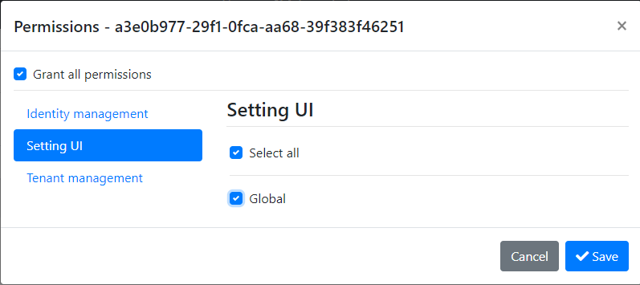
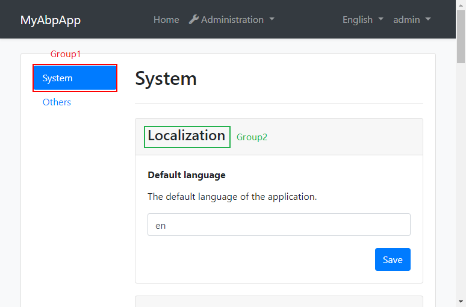
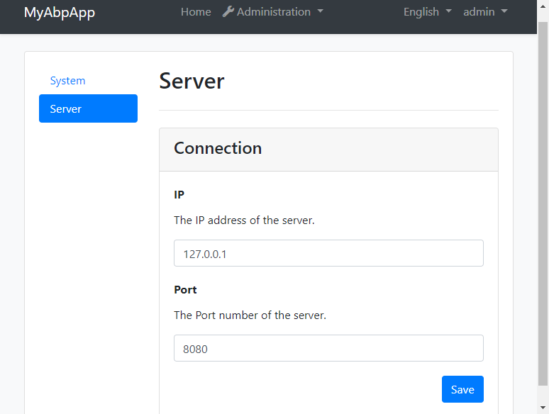

# Abp.SettingUi

[](https://www.nuget.org/packages/EasyAbp.Abp.SettingUi.Domain.Shared)
[](https://www.nuget.org/packages/EasyAbp.Abp.SettingUi.Domain.Shared)

An [ABP](http://abp.io) module used to manage ABP settings



> If you are using ABP version <2.1.1, please see [Abp.SettingManagement.Mvc.UI](https://github.com/wakuflair/Abp.SettingManagement.Mvc.UI)

# Features

* Manage ABP setting values via UI
* Support localization
* Group settings
* Display settings with appropriate input controls

# How to use

Here is a step-by-step tutorial to show you the usage of this module.

## Install module

1. Create an ABP app by using [ABP CLI](https://docs.abp.io/en/abp/latest/CLI)

    `abp new MyAbpApp`

1. Install nuget packages

    There are 4~5 packages need to be installed:

    * `MyAbpApp.Application` project:

        `Install-Package EasyAbp.Abp.SettingUi.Application`

    * `MyAbpApp.Domain.Shared` project:

        `Install-Package EasyAbp.Abp.SettingUi.Domain.Shared`

    * `MyAbpApp.HttpApi` project:

        `Install-Package EasyAbp.Abp.SettingUi.HttpApi`

    * `MyAbpApp.Web` project:

        `Install-Package EasyAbp.Abp.SettingUi.Web`

    * If your application is [Tiered structure](https://docs.abp.io/en/abp/latest/Startup-Templates/Application#tiered-structure), you need install one more package to your `MyAbpApp.HttpApi.Client` project:

        `Install-Package EasyAbp.Abp.SettingUi.HttpApi.Client`

1. Add module dependencies

    * `MyAbpApp.Application` project:

        ``` csharp
        ...
        [DependsOn(typeof(SettingUiApplicationModule))]
        public class MyAbpAppApplicationModule : AbpModule
        {
            ...
        }
        ```

    * `MyAbpApp.Domain.Shared` project:

        ``` csharp
        ...
        [DependsOn(typeof(SettingUiDomainSharedModule))]
        public class MyAbpAppDomainSharedModule : AbpModule
        {
            ...
        }

    * `MyAbpApp.HttpApi` project:

        ``` csharp
        ...
        [DependsOn(typeof(SettingUiHttpApiModule))]
        public class MyAbpAppHttpApiModule : AbpModule
        {
            ...
        }
        ```

    * `MyAbpApp.Web` project:

        ``` csharp
        ...
        [DependsOn(typeof(SettingUiWebModule))]
        public class MyAbpAppWebModule : AbpModule
        {
            ...
        }
        ```

    * If your application is [Tiered structure](https://docs.abp.io/en/abp/latest/Startup-Templates/Application#tiered-structure), you need add one more dependency to your `MyAbpApp.HttpApi.Client` project:

        ``` csharp
        ...
        [DependsOn(typeof(SettingUiHttpApiClientModule))]
        public class MyAbpAppHttpApiClientModule : AbpModule
        {
            ...
        }
        ```


1. Add localization resource to SettingUi

    In order to let SettingUi module use localization resources from this application, we need to add them to `SettingUiResouce`:


    * `MyAbpApp.Domain.Shared` project - `MyAbpAppDomainSharedModule` class

        ``` csharp
        Configure<AbpLocalizationOptions>(options =>
        {
            ...
            options.Resources
                .Get<SettingUiResource>()
                .AddVirtualJson("/Localization/MyAbpApp");
        });
        ```

## Startup

1. Run `MyAbpApp.DbMigrator` to seed database
1. Launch `MyAbpApp.Web`
1. Login with admin/1q2w3E*, then grant permission "Setting UI" - "Tenant" to admin:

    

1. Refresh the browser then you can use "Administration" - "Settings" menu to see all ABP built-in settings

## Manage custom settings

Beside ABP built-in settings, you can also use this module to manage your own settings.

1. Define a setting

    * `MyAbpApp.Domain` project - `Settings/MyAbpAppSettingDefinitionProvider` class

        ``` csharp
        public class MyAbpAppSettingDefinitionProvider : SettingDefinitionProvider
        {
            public override void Define(ISettingDefinitionContext context)
            {
                context.Add(
                    new SettingDefinition(
                        "Connection.Ip", // Setting name
                        "127.0.0.1", // Default value
                        L("DisplayName:Connection.Ip"), // Display name
                        L("Description:Connection.Ip") // Description
                    ));
            }

            private static LocalizableString L(string name)
            {
                return LocalizableString.Create<MyAbpAppResource>(name);
            }
        }
        ```

        * The setting name is "Connection.Ip"
        * Provide a default value: "127.0.0.1"
        * Set the `DisplayName` and `Description` to a localizable string by using a helper method `L`. The format "DisplayName:{SettingName}" is the convention recommended by ABP

        > For ABP setting system, please see [Settings document](https://docs.abp.io/en/abp/latest/Settings)

1. Define localization resources for the setting, for demostration purpose, we defined English and Chinese localization resources

    * `MyAbpApp.Domain.Shared` project

      * `Localization/MyAbpApp/en.json`

        ``` json
        {
            "culture": "en",
            "texts": {
                ...
                "DisplayName:Connection.Ip": "IP",
                "Description:Connection.Ip": "The IP address of the server."
            }
        }
        ```

      * `Localization/MyAbpApp/zh-Hans.json`

        ``` json
        {
            "culture": "zh-Hans",
            "texts": {
                ...
                "DisplayName:Connection.Ip": "IP",
                "Description:Connection.Ip": "服务器的IP地址."
            }
        }
        ```

1. Relaunch the application, we can see the setting displayed, and the localization also works

    

## Grouping

You may notice that our custom setting is displayed in "Others" tab, and "Others" card, these are the default group display names called "Group1" and "Group2" respectively:



So how can we custom the group of the setting? There are two ways:

1. Use `WithProperty` method

    The `WithProperty` method is a mehtod prvoided by ABP `SettingDefinition` class, we can directly use it in setting defining:

    * `MyAbpApp.Domain` project - `Settings/MyAbpAppSettingDefinitionProvider` class

        ``` csharp
        context.Add(
            new SettingDefinition(
                    "Connection.Ip", // Setting name
                    "127.0.0.1", // Default value
                    L("DisplayName:Connection.Ip"), // Display name
                    L("Description:Connection.Ip") // Description
                )
                .WithProperty(SettingUiConst.Group1, "Server")
                .WithProperty(SettingUiConst.Group2, "Connection")
        );
        ```

        * The consts `Group1` and `Group2` are defined in the `SettingUiConst` class
        * Set the "Group1" to "Server", and "Group2" to "Connection"

    Then we should provide the localization resource for these two group names:

    * `MyAbpApp.Domain.Shared` project

      * `Localization/MyAbpApp/en.json`

        ``` json
        {
            "culture": "en",
            "texts": {
                ...
                "Server": "Server",
                "Connection": "Connection"
            }
        }
        ```

      * `Localization/MyAbpApp/zh-Hans.json`

        ``` json
        {
            "culture": "zh-Hans",
            "texts": {
                ...
                "Server": "服务器",
                "Connection": "连接"
            }
        }
        ```

    Relaunch the applciation and see if the group names is correctly set

    

1. Use setting property file

    Antoher way of setting group is use the setting property file, which is provided by the SettingUi module. It's useful when you can not easily modify the setting definition, or you want to put the grouping information into one single place.

    For demostration in this way, let's define a new setting:

    * `MyAbpApp.Domain` project - `Settings/MyAbpAppSettingDefinitionProvider` class

        ``` json
        new SettingDefinition(
            "Connection.Port",
            8080.ToString(),
            L("DisplayName:Connection.Port"),
            L("Description:Connection.Port")
        )
        ```
    > The steps of adding localization for this setting are omitted.

    Then we need to create a new json file with arbitrary filename, however the path must be "/SettingProperties", because SettingUi module will look for the setting property files from this path.

    * `MyAbpApp.Domain.Shared` project - `/SettingProperties/MySettingProperties.json` file

        ``` json
        {
            "Connection.Port": {
                "Group1": "Server",
                "Group2": "Connection"
            }
        }
        ```

        * The setting name `Connection.Port` as the key of the JSON object
        * Use "Group1" and "Group2" to set the grouping names

    * Relaunch the application to see the new grouped setting

        

## Setting types

By default a setting value is string type, which will be rendered as a text input control in UI. We can custom it simpily by providing a setting property "Type":

   * `MyAbpApp.Domain.Shared` project - `/SettingProperties/MySettingProperties.json` file

        ``` json
        {
            "Connection.Port": {
                "Group1": "Server",
                "Group2": "Connection",
                "Type": "number"
            }
        }
        ```

        * Set the "Connection.Port" setting type to "number"

No need to relaunch the application, just press F5 to refresh the browser, you should be able to see the effect immediately:


Now the input type changed to "number", and the frontend validations also work.

> The setting types can also be configured through `WithProperty` method, like `WithProperty("Type", "number")`

For now SettingUi support following setting types:

* text (default)
* number
* checkbox
* select
  * Needs an additional property "Options" to provide select options, which is a string delimitted by vertical bar (|)

    ``` json
    "Connection.Protocol": {
        "Group1": "Server",
        "Group2": "Connection",
        "Type": "select",
        "Options": "|HTTP|TCP|RDP|FTP|SFTP"
    }

    ```

    The render result:

    

This is the end of the tutorial. Through this tutorial, you should be able to easily manage your settings using SettingUi. The source of the tutorial can be found in the [sample folder](https://github.com/EasyAbp/Abp.SettingUi/tree/master/sample)

# Localization

The SettingUI module uses ABP's localization system to display the localization information of the settings.The languages currently supported are:

* en
* zh-Hans

The localization resource files are under `/Localization/SettingUi` of the `EasyAbp.Abp.SettingUi.Domain.Shared` project.

You can add more resource files to make this module support more languages. Welcome PRs :blush: .
> For ABP's localization system, please see [the document](https://docs.abp.io/en/abp/latest/Localization)
